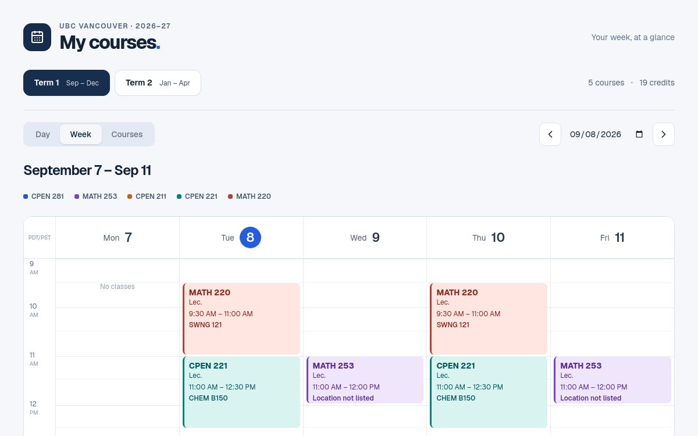

# UBC Course Calendar

A phone-friendly weekly timetable built from a UBC course export. Classes are positioned by their start and end times, with one color per course across lectures, labs, and discussions.

## Features

- Day and week calendar views
- Term 1 and Term 2 schedules
- Tap any class for its section, instructor, room, floor, meeting dates, and delivery mode
- Google Maps and Apple Maps links for listed campus buildings
- Alternate-week meetings preserved from the course export

## Live calendar

Open the hosted calendar at [campus-course-planner.harrisontidy.chatgpt.site](https://campus-course-planner.harrisontidy.chatgpt.site).

## Screenshot



## Run locally

```bash
pnpm install
pnpm dev
```

The source data is in `app/courses.json`, and the schedule logic is in `app/schedule.ts`.
